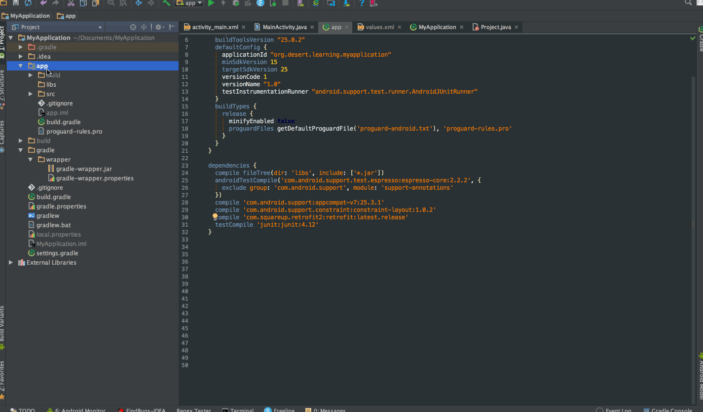

Android Templates
===============

屏幕截图
----------

使用方法
----------

将工程下的目录添加到 **[androidStudio-folder]/plugins/android/lib/templates/other/** ,然后重启启动 AndroidStudio 即可

支持列表
--------------
- [AutoValue](https://github.com/google/auto)
- [AutoValue Gson Support](https://github.com/rharter/auto-value-gson)
- [AutoValue Parcel Support](https://github.com/rharter/auto-value-parcel)
- [ButterKnife](https://github.com/JakeWharton/butterknife)
- [Dagger2](https://github.com/google/dagger)
- [EventBus](https://github.com/greenrobot/EventBus)
- [Glide](https://github.com/bumptech/glide)
- [Hugo](https://github.com/JakeWharton/hugo)
- [LeakCanary](https://github.com/square/leakcanary)
- [Retrofit](https://github.com/square/retrofit)
- [Rxjava2](https://github.com/ReactiveX/RxJava)
- [RxAndroid](https://github.com/ReactiveX/RxAndroid)
- [RxBind](https://github.com/JakeWharton/RxBinding)
- KeyStoreGen Script Support
- Maven Push Template (Mac[CMD+N]\Win[Alt+Insert] --> Gradle --> MavenSupport)

